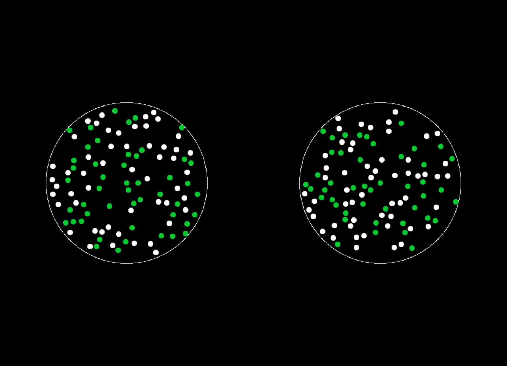
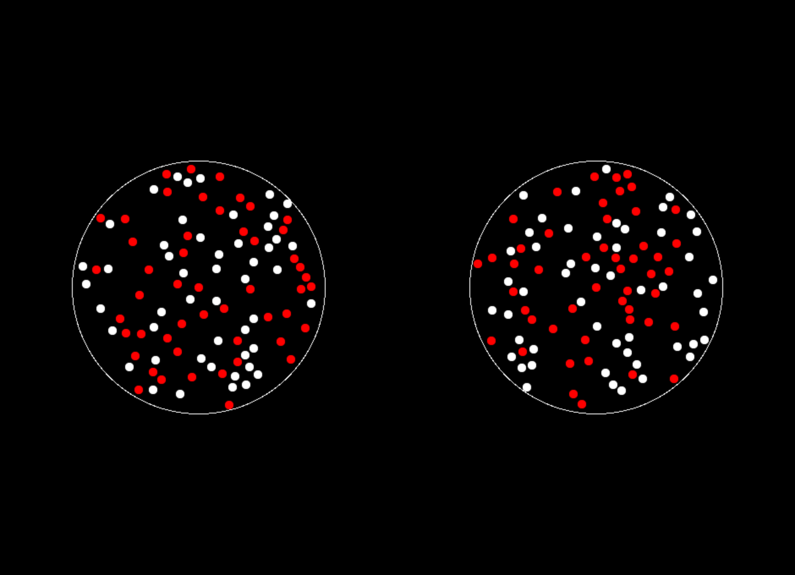

# aDDM Win Loss Lottery Task Demo

## Description
* This version of the task is scaled down and is meant to act as a quick demo of the full task. 
* This version of the task has the Eye-Tracking code set to OFF so that it can be run and shown without the need of the Eye-Tracker. 
* This version of the task only has 5 trials per Block. 
     - 8 Practice Trials
     - 5 WIN Trials
     - 5 LOSS Trials

## Overview
* Subjects carry out a binary choice monetary lottery task while we monitor fixations
* In half of the trials participants choose between WIN lotteries, each associated with a probability p of earning $10 and a probability 1-p of $0

     

* In the other half of the trials participants choose between LOSS trials: each associated  with a probability p of loosing $10 and a probability 1-p of $0

     

## Outline of task events
1. Administer informed consent
2. Written task instructions
3. 8 practice trials (no eye-tracking, they don't count for payment): 4 in WIN frame and 4 in LOSS frame.
4. Eye-tracking calibration (Skipped int the Demo Version)
5. Block of 5 trials
6. Eye-tracking re-calibration (Skipped int the Demo Version)
7. Block of 5 trials
8. Random selection of trials that count for payoff and payment

## Operating Instructions
1. Download this repository to your computer
2. This version of the task is set-up for data collection with the EyeLink 1000 Eye Tracker, do not change any settings unless otherwise instructed. 
     - A demo version of this is available in a seperate repository that can be run without the Eye-Tracker. 
     - Task will not run if it cannot connect to EyeLink.
3. Download Psychtoolbox and add the location to your Matlab PATH. 
4. Open the "main_task.m" file and Click the "RUN" button in your Matlab interface
5. Enter Subject ID
6. Enter which Block to start with
     - Type "win" to start with the WIN Block first
     - Type "los" to start with the LOSS Block first
7. Perform Calibration
8. At the end of the task press "e" to save out the data and close the experiment
9. Behavioral data will be placed in the expdata forlder and the Eye Tracking Data will be placed in the main directory.

## Description of Main Version of the Task
* Subjects perform 400 trials of the task, divided into two 200 trial blocks: one for wins and one for losses, with order counterbalanced across subjects
* Each trial the probability of each WIN or LOSS shown on the screen is selected independently from p = 45%, 46%, ...., 55%
* The stimuli are then assembled as 2 circles each with 100 balls inside. p of them are colored in RED for LOSS trials and GREEN for WIN trials, and 1-p of them are colored WHITE. The location of the balls within the circle is randomized for each stimulus. 
* At the end of the experiment the participant picks a number labelled 1-200 from an urn and the lottery chosen in that trial in both the WIN and LOSS trials is played. (This is done by preparing an urn with the right number of balls and randomly choosing one for each case). 
* Participants are paid a $40 show-up fee + whatever they earn/loose from the randomly chosen lottery trials.
